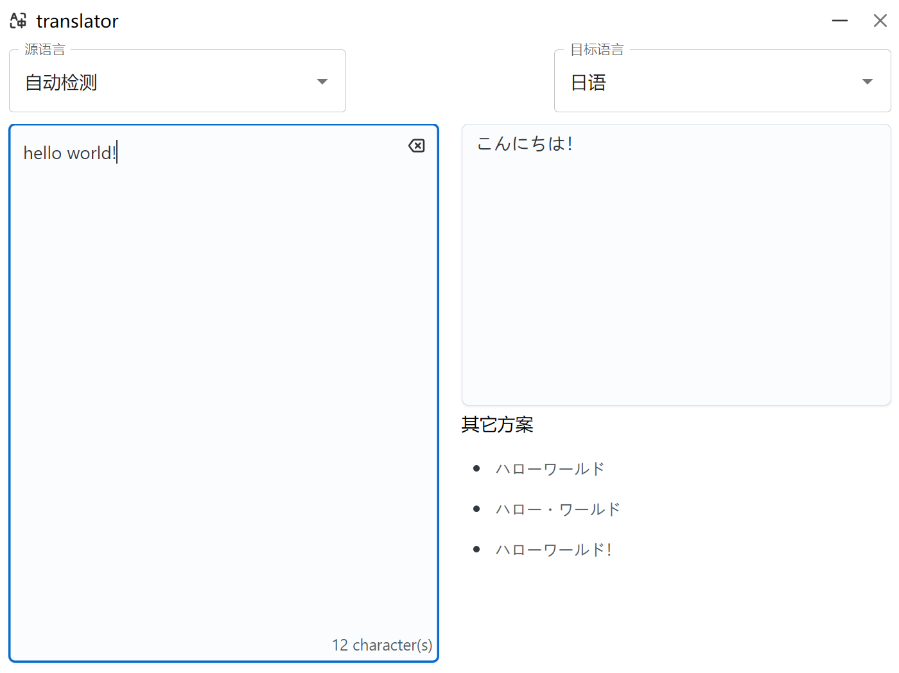

## Description

A client application based on `tauri`, `react` and `deepl`, to realize the function of translation

## Usage

```shell
pnpm install
pnpm tauri dev
```



## languages

Abbreviation Language Writing in own language
BG Bulgarian Български
ZH Chinese 中文
CS Czech Česky
DA Danish Dansk
NL Dutch Nederlands
EN English English
ET Estonian Eesti
FI Finnish Suomi
FR French Français
DE German Deutsch
EL Greek Ελληνικά
HU Hungarian Magyar
IT Italian Italiano
JA Japanese 日本語
LV Latvian Latviešu
LT Lithuanian Lietuvių
PL Polish Polski
PT Portuguese Português
RO Romanian Română
RU Russian Русский
SK Slovak Slovenčina
SL Slovenian Slovenščina
ES Spanish Español
SV Swedish Svenska

## view rust host

```shell
rustc -Vv
```

```
rustc 1.75.0 (82e1608df 2023-12-21)
binary: rustc
commit-hash: 82e1608dfa6e0b5569232559e3d385fea5a93112
commit-date: 2023-12-21
host: x86_64-pc-windows-msvc
release: 1.75.0
LLVM version: 17.0.6
```
